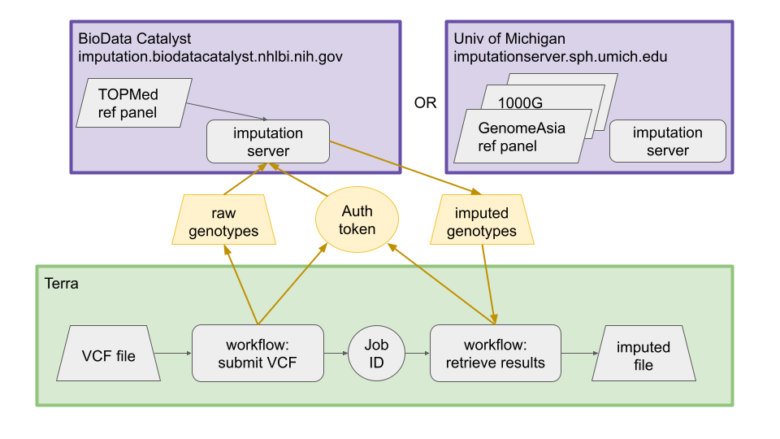

# primed-imputation
**Development version**

This repository is for WDL workflows to submit jobs to the NHLBI BioData Catalyst TOPMed and Michigan imputation servers. This is a work in progress and not yet intended for general use.

## Overview

The [Michigan imputation server](https://imputationserver.sph.umich.edu/) and the [TOPMed imputation server](https://imputation.biodatacatalyst.nhlbi.nih.gov/) are cloud instances of the same imputation software with different reference panels. The [imputationbot](https://github.com/lukfor/imputationbot) software allows a user to submit files to either server using the command line. Users must create an account on the server they wish to use, then download an authentication token. VCF files are uploaded to the server, imputed, and the results are available for download for 7 days.

## Docker

The Dockerfile creates a docker image containing the
[imputationbot](https://github.com/lukfor/imputationbot) software. The
image is available on Docker Hub as
[uwgac/primed-imputation](https://hub.docker.com/r/uwgac/primed-imputation).

## WDL

The workflows are written in the Workflow Description Language ([WDL](https://docs.dockstore.org/en/stable/getting-started/getting-started-with-wdl.html)). This GitHub repository contains the Dockerfile, the WDL code, and JSON files containing inputs to each workflow, both for testing and to serve as examples. The bash scripts were used for testing imputationbot and are not used in the workflows.

### Authenticating

imputationbot has a command to register a token interactively; however, this command writes the token to a file in the user’s home directory. The WDLs take the token as an input string and write the configuration file directly, before running any other commands.

### Submitting a job

The user must specify the following inputs:

input | description
--- | ---
token | string with the authentication token (note the example in the JSON file is not a real token)
hostname | URL for either the [TOPMed](https://imputation.biodatacatalyst.nhlbi.nih.gov/) or [Michigan](https://imputationserver.sph.umich.edu/) server
refpanel | “topmed-r3” is the only option for TOPMed, but there are multiple options for Michigan (see below)
population | “all” for TOPMed, multiple options for Michigan (see below)
vcf_files | files to impute. if `multi_chrom_file` is `true`, only one file should be provided.
multi_chrom_file | boolean, set to `true` if `vcf_files` contains a single file with multiple chromosomes; `false` if `vcf_files` are already split by chromosome
build | genome build of the input files, `hg19` or `hg38`
r2_filter | r2 filter to be applied to the results. Default is `0`, other possible values are `0.001`, `0.1`, `0.2`, `0.3`
meta_imputation | boolean for whether to generate a meta-imputation file. Default is `true`.
password | string that must also be supplied to the results workflow for download. Specifying the password during job submission means the user doesn’t have to rely on receiving the password by email.

When VCF files are submitted to the imputation server, a job_id is
assigned. The submit workflow returns this job_id as an output, and it
must be provided to the results workflow.

### Retrieving results

The workspace specified by `workspace_name` and `workspace_namespace` must already contain the subject, sample, and sample_set tables. The resulting files are added as imputation_dataset and imputation_file tables.

The user must specify the following inputs:

input | description
--- | ---
token | string with the authentication token (note the example in the JSON file is not a real token)
hostname | URL for either the TOPMed or Michigan server
job_id | string returned by the submission workflow
password | string that must also be supplied to the results workflow for download. Specifying the password during job submission means the user doesn’t have to rely on receiving the password by email.
disk_gb | Disk size (in GB) required. If in doubt, consult the Jobs page of the imputation server to view the total file size of the results.
refpanel | The reference panel used for imputation (same value as from imputation_server_submit)
r2_filter | r2 filter that was applied to the results (same value as from imputation_server_submit)
sample_set_id | The sample_set_id of the dataset that was imputed
source_dataset_id | The array_dataset_id of the dataset that was imputed
source_genotypes | A description of the array used for the dataset that was imputed
model_url | A URL providing the path to the data model in JSON format.
import_tables | A boolean indicating whether data model tables should be imported to the workspace.
overwrite | A boolean indicating whether existing rows in the workspace data tables should be overwritten.
workspace_name | A string with the workspace name. e.g, if the workspace URL is https://anvil.terra.bio/#workspaces/fc-product-demo/Terra-Workflows-Quickstart, the workspace name is "Terra-Workflows-Quickstart"
workspace_namespace | A string with the workspace name. e.g, if the workspace URL is https://anvil.terra.bio/#workspaces/fc-product-demo/Terra-Workflows-Quickstart, the workspace namespace is "fc-product-demo"
vcf_disk_gb | Disk space required for each VCF file (default 10 GB). If the job fails due to lack of disk space, try setting this to a larger value.

The imputed genotypes and accompanying files (log, QC report, statistics, md5) are downloaded to the user’s workspace.




### Filtering results

This repository also provides a WDL to extract a set of filtered variant ids using R2 value in the info files.
The user can specify multiple input info files and an R2 threshold.
Variant ids are returned in CHROM:POS:REF:ALT format so that they can be used with other PRIMED workflows that expect this format of variant id.

Variant filtering is performed as follows:

- variants within one sub-array of files are only kept is the R2 value is greater than or equal to the specified R2 value in **all** files
- filtered variants are then concatenated across all sub-arrays

The user must specify the following inputs:

input | description
--- | ---
info files | An Array of arrays of info files returned by the imputation server. The intersection of variants after filtering in each array is kept
r2_minimum | The minimum R2 threshold to filter on


### Reference panels

```
?????????????????????????????????????????????????????????????????????????????????
? ID        ? Name      ? Populations                ? Instance                 ?
?????????????????????????????????????????????????????????????????????????????????
? topmed-r3 ? TOPMed r3 ? all       vs. TOPMed Panel ? TOPMed Imputation Server ?
?           ?           ? mixed     Skip             ?                          ?
?????????????????????????????????????????????????????????????????????????????????

??????????????????????????????????????????????????????????????????????????????????????????????????????????????????????????????????????????
? ID                ? Name                                                    ? Populations                 ? Instance                   ?
??????????????????????????????????????????????????????????????????????????????????????????????????????????????????????????????????????????
? 1000g-phase-1     ? 1000G Phase 1 v3 Shapeit2 (no singletons) (GRCh37/hg19) ? afr       AFR               ? Michigan Imputation Server ?
?                   ?                                                         ? amr       AMR               ?                            ?
?                   ?                                                         ? asn       ASN               ?                            ?
?                   ?                                                         ? eur       EUR               ?                            ?
?                   ?                                                         ? mixed     Other/Mixed       ?                            ?
??????????????????????????????????????????????????????????????????????????????????????????????????????????????????????????????????????????
? 1000g-phase3-low  ? 1000G Phase 3 GRCh38 (BETA)                             ? all       ALL               ? Michigan Imputation Server ?
?                   ?                                                         ? mixed     Other/Mixed       ?                            ?
??????????????????????????????????????????????????????????????????????????????????????????????????????????????????????????????????????????
? 1000g-phase3-deep ? 1000G Phase 3 GRCh38 30x (BETA)                         ? all       ALL               ? Michigan Imputation Server ?
?                   ?                                                         ? mixed     Other/Mixed       ?                            ?
??????????????????????????????????????????????????????????????????????????????????????????????????????????????????????????????????????????
? 1000g-phase-3-v5  ? 1000G Phase 3 v5 (GRCh37/hg19)                          ? afr       AFR               ? Michigan Imputation Server ?
?                   ?                                                         ? amr       AMR               ?                            ?
?                   ?                                                         ? eas       EAS               ?                            ?
?                   ?                                                         ? sas       SAS               ?                            ?
?                   ?                                                         ? eur       EUR               ?                            ?
?                   ?                                                         ? mixed     Other/Mixed       ?                            ?
??????????????????????????????????????????????????????????????????????????????????????????????????????????????????????????????????????????
? caapa             ? CAAPA African American Panel (GRCh37/hg19)              ? AA        African Americans ? Michigan Imputation Server ?
?                   ?                                                         ? mixed     Other/Mixed       ?                            ?
??????????????????????????????????????????????????????????????????????????????????????????????????????????????????????????????????????????
? genome-asia-panel ? Genome Asia Pilot - GAsP (GRCh37/hg19)                  ? asn       ASN               ? Michigan Imputation Server ?
?                   ?                                                         ? mixed     Other/Mixed       ?                            ?
??????????????????????????????????????????????????????????????????????????????????????????????????????????????????????????????????????????
? hapmap-2          ? HapMap 2 (GRCh37/hg19)                                  ? eur       EUR               ? Michigan Imputation Server ?
??????????????????????????????????????????????????????????????????????????????????????????????????????????????????????????????????????????
? hrc-r1.1          ? HRC r1.1 2016 (GRCh37/hg19)                             ? eur       EUR               ? Michigan Imputation Server ?
?                   ?                                                         ? mixed     Other/Mixed       ?                            ?
??????????????????????????????????????????????????????????????????????????????????????????????????????????????????????????????????????????
```
